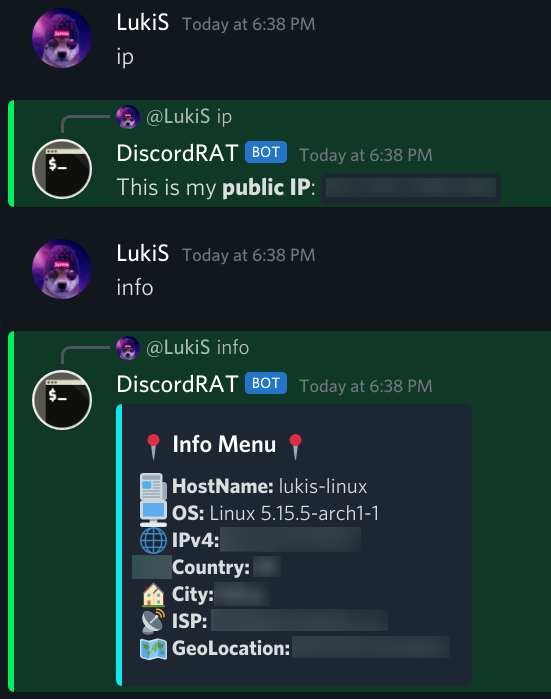
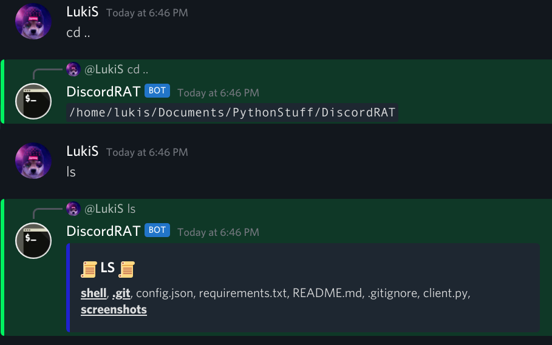
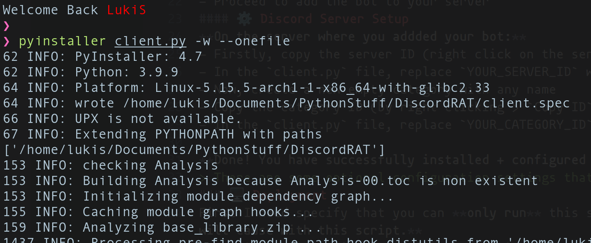
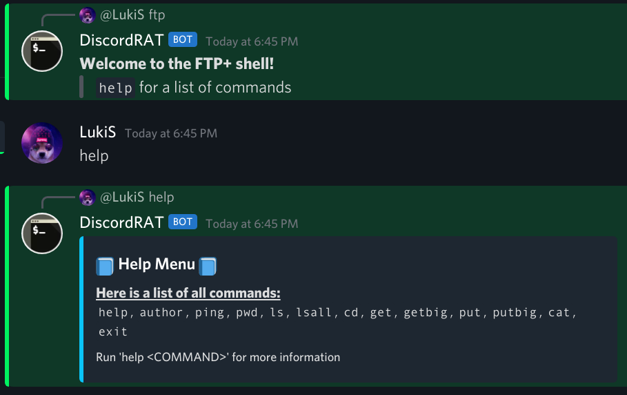
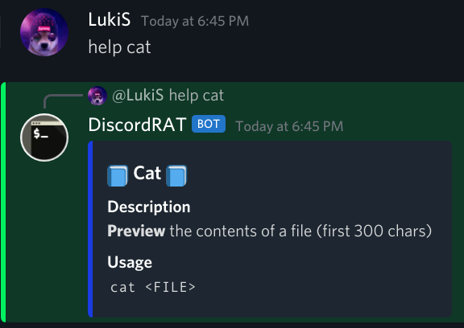

# DiscordRAT
> You want pen. testing a RAT, but you don't have a server to host in on? No problem! This RAT uses discord as its terminal, you can access it with your PC, phone or even your smart watch!
>
> This tool was created for penetration testing purposes only.
### 🔥 Simple DEMO
Information Gathering                                                        |  FTP+ Shell
:---------------------------------------------------------------------------:|:-------------------------------------------------------------:
  |  
### ⚙️ Installation
First you have to install the **required dependencies**, you can do so by running `pip install -r requirements.txt`.
Next you need to **configure** the RAT.
If you are on Linux you will have to install Tkinter, you can do so by running `sudo apt-get install python3-tk` or `sudo pacman -S tk`
#### ⚙️ Discord Bot Setup
You will need to create an __**discord app**__ (bot). You can do so by going [HERE](https://discord.com/developers/applications).
- Click on `New Application` and give it a name.
- On the left side choose `Bot`
- Create a new bot `Add Bot`
- Copy the Token with the button `Copy`
- Now you can replace `YOUR_TOKEN_HERE` in the `client.py` with the token you just copied
- Click `OAuth2` then `URL Generator`
- Under `SCOPES` select `bot` (in the middle), under `BOT PERMISIONS` click `Administrator`
- Now copy the generated URL and visit the URL in a new tab
- Proceed to add the bot to your server
#### ⚙️ Discord Server Setup
**On the server where you addded your bot:**
- Firstly, copy the server ID (right click on the server icon > `Copy ID`)
- In the `client.py` file, replace `YOUR_SERVER_ID` with the ID you copied
- Now, create a new empty category with any name
- Copy the category ID (by right clicking > `Copy ID`)
- In the `client.py` file, replace `YOUR_CATEGORY_ID` with the ID you copied

**__Done!__ You have successfully installed + configured your discord RAT!**
> There are some optional configuration settings that are required to use some of the features, jump to the end if you want to configure them
### 🖥️ Deployment
First I need specify that you can **only run** this script on the devices you have **premission** to test it on. If you don't, **I won't take any responsibility for the damage you will cause with this script.**
Now, with that in mind, you will need `pyinstaller` in order to build the RAT, you can **install** it with `pip install pyinstaller`.
Finaly, you can **build** it using `pyinstaller client.py -w --onefile` (the `-w` flag specifies that we don't need an terminal window when running the RAT).

### 🖥️ First Commands
The bot has a **lot** of command, to get started simply type `help`, after that you can choose any command from the list and get more information about it with `help <COMMAND>`.
Help Menu List                                                           |  Help Menu For Command
:-----------------------------------------------------------------------:|:------------------------------------------------------------------------------:
  |  
### 🟥 Bugs and Issues
If you encounter any bugs or issues, **please create a new issue**. I will try to help you **ASAP**.
> When creating an new issue, please enable `debugMode` and add the output of the RAT so I can help you fix the issue.
>
> `How do I enable it?` In the `client.py` file on line `24` change `debugMode` to `True` and run the RAT
### ⚙️ Optional Configuration
__**Downloading/Uploading Large Files:**__ (over 8MB)
In order to download or upload large files you will need to create an mediafire account:
- First go to the [official mediafire registration website](https://www.mediafire.com/upgrade/registration.php?pid=66)
- Make an new account (for the RAT)
- In the `client.py` file edit the optionalConfig dictionary
- replace the `YOUR_EMAIL_HERE` with your email
- and the `YOUR_PASSWORD_HERE` with your password
